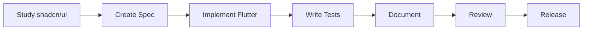

# Flutterbits: Complete Project Analysis & Development Guide

> Everything about building, managing, and deploying the Flutter port of shadcn/ui

**Version**: 3.0
**Last Updated**: November 2025
**Status**: Active Development
**Target Release**: Q1 2026

---

## 🎯 PROJECT OVERVIEW

### What is Flutterbits?

**Flutterbits** is a production-ready Flutter implementation of the popular **shadcn/ui** component library. Unlike traditional package dependencies, Flutterbits follows the copy-paste philosophy where developers maintain complete ownership of their components.

### Core Philosophy

| Principle | Description | Impact |
|-----------|-------------|--------|
| **Copy-Paste Architecture** | Components are copied directly into your project | Full control, no version conflicts |
| **Developer Ownership** | You own and can modify all code | Complete customization freedom |
| **Material 3 Compliant** | Built on Flutter's Material Design 3 | Modern, accessible, beautiful |
| **MUI 6 Aligned** | Matches latest Material UI standards | Industry-standard patterns |
| **Performance First** | Targeting 60-120 FPS with Impeller | Smooth user experience |
| **WCAG 2.2 AA** | Accessibility built-in (with iOS limitations) | Inclusive by default |

### Why Flutterbits in 2025?

- **shadcn/ui proven success**: 85.5K+ GitHub stars
- **Flutter growth**: 4.5M+ developers worldwide
- **Material 3 maturity**: Native Flutter support
- **MUI 6 standards**: Production-ready patterns
- **No Flutter equivalent**: Gap in the market

---

## 📁 PROJECT STRUCTURE

```
Flutterbits/
├── lib/                              # Main Flutter application code
│   ├── main.dart                    # Application entry point
│   ├── app.dart                     # Main app configuration
│   │
│   ├── design/                      # Design system foundation
│   │   ├── tokens/                  # Design tokens (Material 3 compliant)
│   │   │   ├── color_tokens.dart   # Color system (Zinc scale + Material 3)
│   │   │   ├── typography_tokens.dart # Typography scales
│   │   │   ├── spacing_tokens.dart # 8px grid spacing system
│   │   │   ├── radius_tokens.dart  # Border radius tokens
│   │   │   ├── elevation_tokens.dart # Shadow/elevation system
│   │   │   └── animation_tokens.dart # Material 3 motion
│   │   │
│   │   ├── theme/                   # Theme configuration
│   │   │   ├── app_theme.dart      # Main theme setup
│   │   │   ├── light_theme.dart    # Light mode configuration
│   │   │   ├── dark_theme.dart     # Dark mode configuration
│   │   │   └── dynamic_theme.dart  # Material You dynamic colors
│   │   │
│   │   └── primitives/              # Base building blocks
│   │       ├── interactive_wrapper.dart # Interaction handling
│   │       ├── surface_container.dart   # Container primitive
│   │       ├── focus_wrapper.dart       # Focus management
│   │       └── semantic_wrapper.dart    # Accessibility wrapper
│   │
│   ├── components/                  # UI Components (shadcn/ui ports)
│   │   ├── ui/                     # Core components
│   │   │   ├── button.dart         # ✅ Button (60% complete)
│   │   │   ├── input.dart          # 🔄 Input (planning)
│   │   │   ├── card.dart           # 🔄 Card (planning)
│   │   │   ├── badge.dart          # ✅ Badge (60% complete)
│   │   │   ├── avatar.dart         # 🔄 Avatar (planning)
│   │   │   ├── alert.dart          # 🔄 Alert (planning)
│   │   │   ├── switch.dart         # 🔄 Switch (planning)
│   │   │   ├── checkbox.dart       # 🔄 Checkbox (planning)
│   │   │   ├── dialog.dart         # 🔄 Dialog (planning)
│   │   │   ├── select.dart         # 🔄 Select (planning)
│   │   │   ├── dropdown_menu.dart  # 🔄 Dropdown (planning)
│   │   │   ├── tabs.dart           # 🔄 Tabs (planning)
│   │   │   ├── toast.dart          # 🔄 Toast (planning)
│   │   │   └── data_table.dart     # 🔄 DataTable (planning)
│   │   │
│   │   ├── layout/                 # Layout components
│   │   │   ├── container.dart      # Responsive container
│   │   │   ├── stack.dart          # Stack layouts
│   │   │   ├── grid.dart           # Grid system
│   │   │   └── spacer.dart         # Spacing utilities
│   │   │
│   │   └── composite/              # Complex components
│   │       ├── form.dart           # Form wrapper
│   │       ├── navigation_rail.dart # Navigation rail
│   │       ├── navigation_drawer.dart # Navigation drawer
│   │       └── app_bar.dart        # Application bar
│   │
│   ├── examples/                    # Component examples
│   │   ├── button_examples.dart    # Button usage examples
│   │   ├── form_examples.dart      # Form patterns
│   │   ├── layout_examples.dart    # Layout patterns
│   │   └── theme_examples.dart     # Theme customization
│   │
│   ├── utils/                       # Utilities
│   │   ├── accessibility.dart      # WCAG helpers
│   │   ├── responsive.dart         # Responsive breakpoints
│   │   ├── platform.dart           # Platform detection
│   │   ├── color_utils.dart        # Color manipulation
│   │   └── performance.dart        # Performance utilities
│   │
│   └── showcase/                    # Demo application
│       ├── home_screen.dart        # Component gallery
│       ├── theme_preview.dart      # Theme testing
│       ├── playground.dart         # Interactive playground
│       └── performance_monitor.dart # Performance metrics
│
├── test/                            # Test files
│   ├── unit/                       # Unit tests
│   │   ├── tokens/                 # Token tests
│   │   └── utils/                  # Utility tests
│   ├── widget/                     # Widget tests
│   │   └── components/             # Component tests
│   ├── integration/                # Integration tests
│   ├── accessibility/              # WCAG compliance tests
│   ├── performance/                # Performance benchmarks
│   └── golden/                     # Visual regression tests
│
├── packages/
│   └── flutterbits_cli/           # CLI tool package
│       ├── bin/
│       │   └── flutterbits.dart   # CLI entry point
│       ├── lib/
│       │   ├── src/
│       │   │   ├── commands/      # CLI commands
│       │   │   │   ├── init_command.dart
│       │   │   │   ├── add_command.dart
│       │   │   │   ├── update_command.dart
│       │   │   │   ├── list_command.dart
│       │   │   │   └── doctor_command.dart
│       │   │   ├── templates/     # Component templates
│       │   │   ├── registry/      # Component registry
│       │   │   └── utils/         # CLI utilities
│       │   └── flutterbits_cli.dart
│       ├── pubspec.yaml
│       └── README.md
│
├── tools/                          # Development tools
│   ├── analyzer/                  # Custom lint rules
│   ├── generator/                 # Code generation
│   └── scripts/                   # Build scripts
│
├── docs/                           # Documentation
│   ├── getting_started.md
│   ├── component_guide.md
│   ├── design_system.md
│   ├── accessibility.md
│   └── migration_guide.md
│
├── .github/
│   ├── workflows/                 # GitHub Actions
│   │   ├── test.yml              # Test pipeline
│   │   ├── build.yml             # Build pipeline
│   │   ├── release.yml           # Release automation
│   │   └── deploy.yml            # Deployment pipeline
│   ├── ISSUE_TEMPLATE/           # Issue templates
│   └── PULL_REQUEST_TEMPLATE/    # PR templates
│
├── Configuration Files:
├── pubspec.yaml                   # Flutter dependencies
├── analysis_options.yaml          # Dart analyzer config
├── l10n.yaml                     # Localization config
├── mason.yaml                    # Mason CLI config
├── .gitignore                    # Git ignore rules
├── .metadata                     # Flutter metadata
├── README.md                     # Project readme
├── LICENSE                       # MIT License
├── CONTRIBUTING.md               # Contribution guide
├── CHANGELOG.md                  # Version history
└── SECURITY.md                   # Security policy
```

---

## 🚀 QUICK START

### Prerequisites

```bash
# System Requirements
- Flutter SDK: 3.24.0+
- Dart SDK: 3.0.0+
- Platform SDKs: iOS/Android/Web as needed

# Verify installation
flutter --version
dart --version
flutter doctor
```

### Installation

```bash
# 1. Clone the repository
git clone https://github.com/yourusername/Flutterbits.git
cd Flutterbits

# 2. Install dependencies
flutter pub get

# 3. Verify setup
flutter analyze
flutter test

# 4. Run the showcase app
flutter run
```

### Platform-Specific Setup

#### iOS
```bash
cd ios
pod install
cd ..
flutter run -d ios
```

#### Android
```bash
flutter run -d android
```

#### Web
```bash
flutter run -d chrome
```

#### Desktop
```bash
# macOS
flutter run -d macos

# Windows
flutter run -d windows

# Linux
flutter run -d linux
```

---

## 📊 COMPONENT DEVELOPMENT STATUS

### Overview Metrics

| Metric | Value | Target |
|--------|-------|--------|
| **Total Components** | 30 | 30 |
| **Completed** | 0 | 8 (MVP) |
| **In Progress** | 2 | - |
| **Test Coverage** | 0% | >80% |
| **Documentation** | 20% | 100% |
| **Accessibility** | Planning | WCAG 2.2 AA |

### Component Tiers & Status

#### Tier 0: Foundation Components (No Dependencies)

| Component | Status | Progress | Started | Notes |
|-----------|--------|----------|---------|-------|
| **Badge** | 🟡 In Progress | 60% | Nov 2025 | Design analysis complete, implementation started |
| **Avatar** | 📋 Planning | 0% | - | Next priority |
| **Alert** | 📋 Planning | 0% | - | Includes all semantic variants |

#### Tier 1: Core Interactive Components

| Component | Status | Progress | Started | Dependencies |
|-----------|--------|----------|---------|--------------|
| **Button** | 🟡 In Progress | 60% | Nov 2025 | None |
| **Input** | 📋 Planning | 0% | - | None |
| **Switch** | 📋 Planning | 0% | - | None |
| **Checkbox** | 📋 Planning | 0% | - | None |
| **Radio** | 📋 Planning | 0% | - | None |

#### Tier 2: Container Components

| Component | Status | Progress | Started | Dependencies |
|-----------|--------|----------|---------|--------------|
| **Card** | 📋 Planning | 0% | - | None |
| **Dialog** | 📋 Planning | 0% | - | Button, Focus management |
| **Accordion** | 📋 Planning | 0% | - | None |

#### Tier 3: Complex Components

| Component | Status | Progress | Started | Dependencies |
|-----------|--------|----------|---------|--------------|
| **Select** | 📋 Planning | 0% | - | Input, Dropdown |
| **Dropdown Menu** | 📋 Planning | 0% | - | Button |
| **Context Menu** | 📋 Planning | 0% | - | Menu primitives |
| **Command** | 📋 Planning | 0% | - | Input, List |
| **Combobox** | 📋 Planning | 0% | - | Input, Select |

#### Tier 4: Advanced Components

| Component | Status | Progress | Started | Dependencies |
|-----------|--------|----------|---------|--------------|
| **Data Table** | 📋 Planning | 0% | - | Table, Checkbox |
| **Tabs** | 📋 Planning | 0% | - | Navigation |
| **Toast** | 📋 Planning | 0% | - | Animation |
| **Carousel** | 📋 Planning | 0% | - | Gesture handling |
| **Calendar** | 📋 Planning | 0% | - | Date handling |

### Component Implementation Checklist

For each component, we track:

- [x] **Design Analysis** - Study shadcn/ui implementation
- [x] **Specification Document** - Document all variants, sizes, states
- [x] **Flutter Implementation** - Build the component
- [ ] **Widget Tests** - >80% coverage
- [ ] **Golden Tests** - Visual regression
- [ ] **Accessibility Audit** - WCAG 2.2 compliance
- [ ] **Performance Benchmarks** - <16ms render time
- [ ] **Documentation** - Usage examples and API docs
- [ ] **Code Review** - 2 approvals minimum
- [ ] **Release** - Merged to main

---

## 🎨 DESIGN SYSTEM ARCHITECTURE

### Material 3 Integration

Flutterbits aligns with Material 3 (Material You) design principles:

```dart
// Material 3 is enabled by default
ThemeData(
  useMaterial3: true,
  colorScheme: ColorScheme.fromSeed(
    seedColor: ColorTokens.primary,
    brightness: Brightness.light,
    dynamicSchemeVariant: DynamicSchemeVariant.tonalSpot,
  ),
)
```

### MUI 6 Alignment Strategy

| Aspect | MUI 6 | Flutterbits | Status |
|--------|-------|-------------|--------|
| **Color System** | CSS Variables | Design Tokens | ✅ Implemented |
| **Typography** | Roboto/System | System Font | ✅ Implemented |
| **Spacing** | 8px Grid | 8px Grid | ✅ Implemented |
| **Motion** | Material 3 Easing | Material 3 Curves | ✅ Implemented |
| **Components** | Full MD3 Set | In Progress | 🔄 Building |
| **Themes** | Dynamic Color | Dynamic Color | ✅ Supported |

### Design Token System

```dart
// Complete token system
├── ColorTokens       # Zinc scale + Material 3
├── TypographyTokens  # Material 3 type scale
├── SpacingTokens     # 8px grid system
├── RadiusTokens      # Border radius scale
├── ElevationTokens   # Shadow system
└── AnimationTokens   # Motion design
```

---

## 🛠️ DEVELOPMENT WORKFLOW

### Adding a New Component



#### Step 1: Study Original Component
```bash
# 1. Visit shadcn/ui docs
https://ui.shadcn.com/docs/components/[component]

# 2. Inspect with DevTools
# Extract colors, spacing, animations

# 3. Check Radix UI primitives
https://radix-ui.com/primitives
```

#### Step 2: Create Specification
```markdown
# [Component] Specification
- Variants: primary, secondary, destructive...
- Sizes: sm, md, lg
- States: normal, hover, active, disabled, focus
- Colors: exact hex values
- Spacing: padding, margins
- Typography: font sizes, weights
- Animations: duration, easing
```

#### Step 3: Implement in Flutter
```dart
// lib/components/ui/[component].dart
class Component extends StatelessWidget {
  // Match shadcn/ui API exactly
}
```

#### Step 4: Write Tests
```bash
# Create test files
touch test/widget/components/[component]_test.dart
touch test/golden/[component]_golden_test.dart
touch test/accessibility/[component]_a11y_test.dart

# Run tests
flutter test
flutter test --update-goldens
```

#### Step 5: Document
```dart
/// Component documentation
/// Usage examples
/// API reference
```

#### Step 6: Code Review
- Create PR with description
- Get 2 approvals
- Address feedback
- Merge to main

---

## 🧪 TESTING STRATEGY

### Test Coverage Requirements

| Test Type | Coverage | Purpose |
|-----------|----------|---------|
| **Unit Tests** | ≥80% | Logic verification |
| **Widget Tests** | 100% | Behavior testing |
| **Golden Tests** | All variants | Visual regression |
| **Accessibility** | WCAG 2.2 | Compliance |
| **Performance** | All components | 60 FPS target |
| **Integration** | Critical paths | E2E flows |

### Running Tests

```bash
# All tests
flutter test

# Specific test types
flutter test test/unit/
flutter test test/widget/
flutter test test/golden/ --update-goldens
flutter test test/accessibility/ --tags=accessibility
flutter test test/performance/ --profile

# With coverage
flutter test --coverage
genhtml coverage/lcov.info -o coverage/html
open coverage/html/index.html

# CI/CD testing
flutter test --machine > test-results.json
```

### Test Examples

#### Widget Test
```dart
testWidgets('Button responds to tap', (tester) async {
  var pressed = false;

  await tester.pumpWidget(
    MaterialApp(
      home: Button(
        onPressed: () => pressed = true,
        child: Text('Tap me'),
      ),
    ),
  );

  await tester.tap(find.byType(Button));
  expect(pressed, true);
});
```

#### Golden Test
```dart
testWidgets('Button visual regression', (tester) async {
  await tester.pumpWidget(TestApp(child: Button()));
  await expectLater(
    find.byType(Button),
    matchesGoldenFile('button.png'),
  );
});
```

#### Accessibility Test
```dart
testWidgets('Button is accessible', (tester) async {
  await expectMeetsAccessibilityGuidelines(
    tester,
    textContrastGuideline,
    androidTapTargetGuideline,
    labeledTapTargetGuideline,
  );
});
```

---

## 📊 PERFORMANCE OPTIMIZATION

### Performance Targets

| Metric | Target | Current | Status |
|--------|--------|---------|--------|
| **Frame Rate** | 60-120 FPS | - | 🔄 Testing |
| **Render Time** | <16ms | - | 🔄 Testing |
| **Memory** | <50MB base | - | 🔄 Testing |
| **Bundle Size** | <5MB/component | - | 🔄 Testing |
| **Time to Interactive** | <100ms | - | 🔄 Testing |

### Optimization Strategies

#### 1. Const Constructors
```dart
// ✅ Good - prevents rebuilds
const Button(child: const Text('Click'));

// ❌ Bad - causes rebuilds
Button(child: Text('Click'));
```

#### 2. Efficient State Management
```dart
// Use ValueListenableBuilder for single values
ValueListenableBuilder<bool>(
  valueListenable: _isLoading,
  builder: (context, value, child) => ...,
);
```

#### 3. Lazy Loading
```dart
// Load components on demand
final component = await ComponentRegistry.lazy('data_table');
```

#### 4. RepaintBoundary
```dart
RepaintBoundary(
  child: ExpensiveWidget(),  // Isolate repaints
)
```

### Performance Monitoring

```dart
// lib/utils/performance.dart
class PerformanceMonitor {
  static void measureFrame(VoidCallback callback) {
    final stopwatch = Stopwatch()..start();
    callback();
    stopwatch.stop();

    if (stopwatch.elapsedMilliseconds > 16) {
      log('Frame took ${stopwatch.elapsedMilliseconds}ms');
    }
  }
}
```

---

## 🚀 CI/CD PIPELINE

### GitHub Actions Workflows

#### Test Pipeline (.github/workflows/test.yml)
```yaml
name: Test
on: [push, pull_request]

jobs:
  test:
    runs-on: ubuntu-latest
    steps:
      - uses: actions/checkout@v3
      - uses: subosito/flutter-action@v2
        with:
          flutter-version: '3.24.0'

      - name: Install dependencies
        run: flutter pub get

      - name: Analyze
        run: flutter analyze

      - name: Test
        run: flutter test --coverage

      - name: Upload coverage
        uses: codecov/codecov-action@v3
```

#### Build Pipeline (.github/workflows/build.yml)
```yaml
name: Build
on:
  push:
    branches: [main]

jobs:
  build-android:
    # Build APK

  build-ios:
    # Build IPA

  build-web:
    # Build web assets

  build-desktop:
    # Build desktop apps
```

#### Release Pipeline (.github/workflows/release.yml)
```yaml
name: Release
on:
  push:
    tags:
      - 'v*'

jobs:
  release:
    # Create GitHub release
    # Publish to pub.dev
    # Deploy documentation
```

### Deployment Strategy

| Stage | Trigger | Action | Target |
|-------|---------|--------|--------|
| **Development** | Push to feature branch | Run tests | - |
| **Staging** | PR to main | Full test suite | Preview deployment |
| **Production** | Merge to main | Build & deploy | Production |
| **Release** | Tag push | Package & publish | pub.dev |

---

## ♿ ACCESSIBILITY COMPLIANCE

### WCAG 2.2 Requirements

| Guideline | Requirement | Implementation | Status |
|-----------|------------|----------------|--------|
| **Color Contrast** | 4.5:1 normal, 3:1 large | Token validation | ✅ |
| **Touch Targets** | 44x44 iOS, 48x48 Android | Size constraints | ✅ |
| **Keyboard Navigation** | Full keyboard support | Focus management | ✅ |
| **Screen Readers** | Semantic labels | Semantics widgets | ✅ |
| **Focus Indicators** | Visible focus | Focus decoration | ✅ |

### Known Limitations

⚠️ **iOS Limitation**: Full keyboard navigation not completely supported by Flutter framework

### Testing Accessibility

```bash
# Enable screen readers
# iOS: Settings > Accessibility > VoiceOver
# Android: Settings > Accessibility > TalkBack

# Run accessibility tests
flutter test test/accessibility/

# Use Flutter Inspector
flutter run --debug
# Open DevTools > Widget Inspector > Semantics
```

---

## 🐛 TROUBLESHOOTING

### Common Issues & Solutions

#### Issue: Component not rendering correctly
```bash
# Solution 1: Clear caches
flutter clean
flutter pub get
flutter run

# Solution 2: Restart IDE
# Solution 3: Check theme configuration
```

#### Issue: Golden test failures
```bash
# Update golden files
flutter test --update-goldens

# Platform-specific goldens
flutter test --update-goldens --platform=macos
```

#### Issue: Performance problems
```bash
# Profile mode analysis
flutter run --profile

# Open DevTools
flutter devtools

# Check Performance tab
```

#### Issue: Accessibility warnings
```bash
# Enable accessibility inspector
flutter run --debug
# Open Flutter Inspector > Accessibility

# Check contrast ratios
# Verify touch target sizes
# Test with screen reader
```

#### Issue: Build failures
```bash
# iOS build issues
cd ios
pod install
pod update
cd ..

# Android build issues
cd android
./gradlew clean
cd ..

# General fix
flutter doctor -v
```

---

## 📈 PROJECT ROADMAP

### Phase 1: Foundation (Current - Q1 2026)
- [x] Project setup and structure
- [x] Design token system
- [x] Theme configuration
- [ ] Core components (8 MVP)
- [ ] CLI tool v1.0
- [ ] Documentation site

### Phase 2: Expansion (Q2 2026)
- [ ] Complete Tier 1-2 components
- [ ] Enhanced CLI features
- [ ] Component playground
- [ ] Community templates

### Phase 3: Production (Q3 2026)
- [ ] All 30+ components
- [ ] Performance optimization
- [ ] Accessibility certification
- [ ] v1.0.0 stable release

### Phase 4: Ecosystem (Q4 2026)
- [ ] Figma design kit
- [ ] VS Code extension
- [ ] Component marketplace
- [ ] Enterprise features

---

## 🤝 CONTRIBUTING

### Development Setup

1. **Fork & Clone**
   ```bash
   git clone https://github.com/yourusername/Flutterbits.git
   cd Flutterbits
   ```

2. **Create Branch**
   ```bash
   git checkout -b feat/component-name
   ```

3. **Make Changes**
   - Follow code style
   - Write tests
   - Update docs

4. **Test**
   ```bash
   flutter analyze
   flutter test
   ```

5. **Submit PR**
   - Clear description
   - Link issues
   - Screenshots if UI

### Commit Convention

```
feat(button): add loading state
fix(input): resolve focus issue
docs(readme): update installation
test(card): add widget tests
refactor(theme): improve token system
chore(deps): update dependencies
```

### Code Review Process

1. **Automated Checks**
   - Tests pass
   - Coverage >80%
   - No lint errors

2. **Human Review**
   - 2 approvals required
   - Design review for UI
   - Accessibility check

3. **Merge**
   - Squash and merge
   - Update changelog
   - Deploy preview

---

## 📊 METRICS & ANALYTICS

### Development Metrics

| Metric | Current | Target | Trend |
|--------|---------|--------|-------|
| **Component Completion** | 6.7% | 100% | 📈 |
| **Test Coverage** | 0% | >80% | 🔄 |
| **Documentation** | 20% | 100% | 📈 |
| **Performance** | - | 60 FPS | 🔄 |
| **Bundle Size** | - | <50MB | 🔄 |

### Community Metrics

| Metric | Current | Target |
|--------|---------|--------|
| **GitHub Stars** | 0 | 5,000 |
| **Contributors** | 1 | 50 |
| **Weekly Downloads** | 0 | 10,000 |
| **Discord Members** | 0 | 1,000 |

---

## 📚 RESOURCES

### Documentation
- **Project Docs**: `/docs` directory
- **Component Guide**: `COMPLETE_CONVERSION_GUIDE.md`
- **API Reference**: Generated from code
- **Examples**: `/lib/examples` directory

### External Resources
- **shadcn/ui**: https://ui.shadcn.com
- **Material 3**: https://m3.material.io
- **Flutter Docs**: https://docs.flutter.dev
- **MUI 6**: https://mui.com
- **WCAG 2.2**: https://www.w3.org/WAI/WCAG22/

### Community
- **GitHub**: Issues & Discussions
- **Discord**: Coming soon
- **Twitter**: @flutterbits
- **Blog**: blog.flutterbits.dev

---

## 🔐 SECURITY

### Security Policy

Report vulnerabilities to: security@flutterbits.dev

### Best Practices
- No hardcoded secrets
- Validate all inputs
- Sanitize user content
- Regular dependency updates
- Security audits quarterly

---

## 📝 LICENSE

MIT License - See [LICENSE](LICENSE) file

```
MIT License

Copyright (c) 2025 Flutterbits

Permission is hereby granted, free of charge, to any person obtaining a copy
of this software and associated documentation files (the "Software"), to deal
in the Software without restriction...
```

---

## 🎯 QUICK REFERENCE

### Commands

```bash
# Development
flutter run                      # Run app
flutter test                     # Run tests
flutter analyze                  # Static analysis
flutter build [platform]         # Build for platform

# CLI Tool
flutterbits init                # Initialize project
flutterbits add [component]     # Add component
flutterbits list                # List components
flutterbits update [component]  # Update component
flutterbits doctor              # Check setup

# Git
git checkout -b feat/[name]     # New feature branch
git commit -m "type(scope): msg" # Commit with convention
git push origin feat/[name]     # Push branch
```

### File Patterns

```dart
// Component
lib/components/ui/[component].dart

// Test
test/widget/components/[component]_test.dart

// Golden
test/golden/[component]_golden_test.dart

// Example
lib/examples/[component]_examples.dart
```

### Import Pattern

```dart
// Design tokens
import 'design/tokens/color_tokens.dart';

// Components
import 'components/ui/button.dart';

// Theme
import 'design/theme/app_theme.dart';

// Utils
import 'utils/accessibility.dart';
```

---

**End of Complete Project Analysis**
**Total Sections**: 20
**Status**: Active Development
**Version**: 3.0
**Last Updated**: November 2025
**Target Release**: Q1 2026